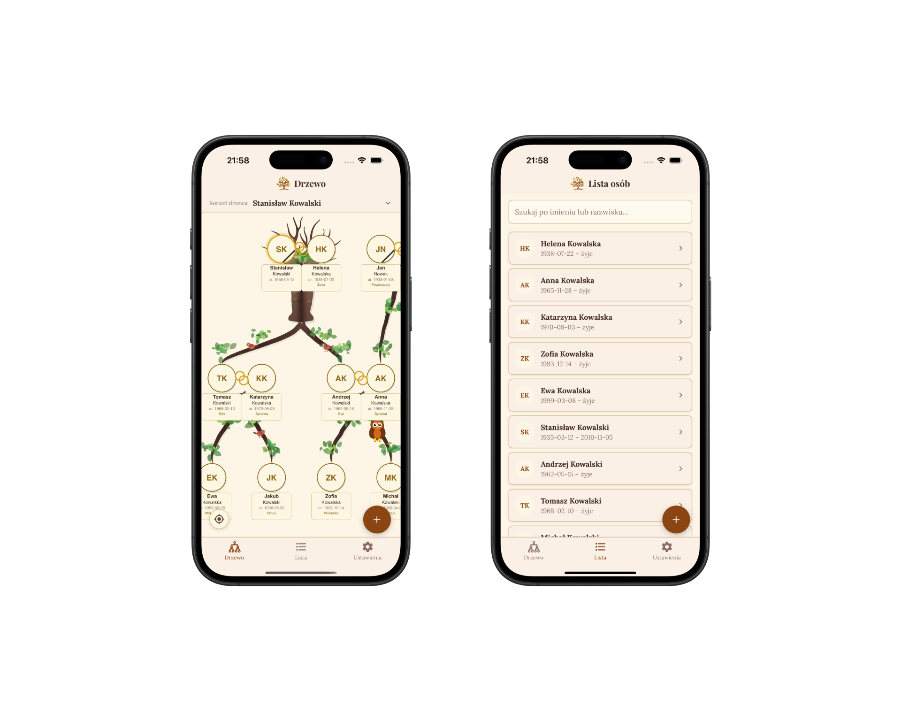

<p align="center">
  
</p>

<h1 align="center">FamilyTree</h1>

<p align="center">
  <strong>Your family history, beautifully preserved.</strong>
  <br />
  A mobile genealogy app with organic tree visualization — built with React Native & Expo.
</p>

<p align="center">
  <a href="https://github.com/mateuszbialowas/FamilyTree/actions/workflows/docs.yml"></a>
  
  
  
  
  
</p>

<p align="center">
  <a href="https://mateuszbialowas.github.io/FamilyTree/">Documentation</a> &bull;
  <a href="https://mateuszbialowas.github.io/FamilyTree/privacy-policy">Privacy Policy</a> &bull;
  <a href="#-getting-started">Getting Started</a>
</p>

---

<p align="center">
  
</p>

## Highlights

- **Organic tree visualization** — procedurally generated trunks, branches, leaves, and animals rendered with Skia
- **Smart relationship engine** — define parents, children, and spouses; the app infers grandparents, cousins, uncles, and more
- **100% offline** — all data stays on your device, no accounts, no cloud
- **Import & export** — back up and share family data as JSON
- **Animated details** — swaying leaves, blinking owls, bobbing birds, and wagging squirrel tails

## Features

| Feature | Description |
|---------|-------------|
| **Tree view** | Interactive canvas with pinch-to-zoom, pan, and tap-to-navigate |
| **People list** | Searchable list with initials avatars |
| **Relationships** | Parent-child, marriage (with dates), inferred siblings |
| **Tree modes** | Ancestors, descendants, or both — auto-detected based on data |
| **Long press** | Quick-add a relative directly from the tree |
| **Mourning band** | Deceased family members shown with a black band |
| **Data management** | Export, import, and clear all data from Settings |

## Getting Started

### Prerequisites

- [Node.js](https://nodejs.org/) 18+
- [Expo CLI](https://docs.expo.dev/get-started/installation/)
- iOS Simulator (macOS) or Android Emulator

### Installation

```bash
git clone https://github.com/mateuszbialowas/FamilyTree.git
cd FamilyTree
npm install
```

### Run

```bash
# iOS
npx expo run:ios

# Android
npx expo run:android

# Expo dev server (press i/a to pick platform)
npm start
```

### Sample data

Want to see the tree in action? Import the sample family file:

1. Download [`sample-family.json`](docs/public/sample-family.json)
2. Open the app → **Ustawienia** (Settings) → **Importuj dane**
3. Select the file — a 3-generation Polish family will appear

## Tech Stack

| | Technology | Version |
|---|---|---|
| **Framework** | Expo + React Native | ~54 / 0.81 |
| **Language** | TypeScript | ~5.9 |
| **UI** | React | 19.1 |
| **Canvas** | @shopify/react-native-skia | 2.2 |
| **Navigation** | React Navigation | v7 |
| **Storage** | AsyncStorage | 2.2 |
| **Fonts** | Playfair Display, Lora | Google Fonts |
| **E2E Tests** | Maestro | CLI |

## Architecture

```
src/
├── components/
│   ├── tree/            # Skia canvas, geometry, animals
│   ├── ui/              # Button, TextInput, Card, etc.
│   ├── PersonListItem.tsx
│   └── RelationshipCard.tsx
├── context/
│   └── FamilyContext.tsx # useReducer + AsyncStorage (500ms debounce)
├── navigation/          # Bottom tabs + native stacks
├── screens/             # All app screens
├── theme/               # Colors, typography, spacing
├── types/               # Person, Relationship, Marriage
└── utils/               # UUID, tree layout, relationship labels
```

> Full architecture docs: [mateuszbialowas.github.io/FamilyTree/guide/architecture](https://mateuszbialowas.github.io/FamilyTree/guide/architecture)

## Commands

| Command | Description |
|---------|-------------|
| `npm start` | Start Expo dev server |
| `npx expo run:ios` | Build & run on iOS simulator |
| `npx expo run:android` | Build & run on Android emulator |
| `npm run test:e2e` | Run all Maestro E2E tests |
| `npm run test:e2e:single <file>` | Run a single Maestro test |
| `npx expo prebuild --clean` | Regenerate native projects |

## Contributing

Contributions are welcome! Please read the [contributing guide](https://mateuszbialowas.github.io/FamilyTree/guide/contributing) before submitting a PR.

1. Fork the repo
2. Create your branch (`git checkout -b feature/amazing-feature`)
3. Commit your changes
4. Push and open a Pull Request

## License

Distributed under the MIT License. See `LICENSE` for more information.

---

<p align="center">
  Made with &#10084; by <a href="https://github.com/mateuszbialowas">Mateusz Białowąs</a>
</p>
